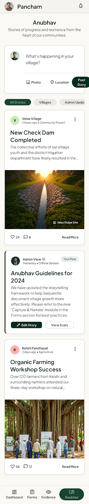

## Brand & Style

The design system is anchored in the values of stewardship, growth, and community resilience. It is tailored for a rural development platform that must bridge the gap between institutional authority and grassroots accessibility. The visual language avoids the cold, clinical feel of standard enterprise software in favor of a "Human-Centric Institutional" style—professional enough for government stakeholders, yet warm and legible for field workers and rural citizens.

The aesthetic blends **Modern Corporate** reliability with **Tactile/Organic** warmth. It prioritizes clarity and high contrast to ensure usability in varied lighting conditions (such as outdoor field use) and on diverse mobile hardware. The emotional goal is to evoke a sense of grounded progress and trusted partnership.

## Colors

The palette is derived from the natural landscape of rural development. 

- **Primary (Forest Green):** Used for primary actions, navigation headers, and brand-level elements to signal stability and growth.
- **Secondary (Terracotta):** Reserved for meaningful accents, call-to-outs, and specific interactive elements that require distinction without being aggressive.
- **Backgrounds:** A tiered system using soft cream (#F9F7F2) for page backgrounds to reduce eye strain, and pure white (#FFFFFF) for cards and interactive surfaces to create a clear "layer" effect.
- **Semantic Colors:** Success states utilize subtle sage greens rather than harsh neon greens, maintaining the calm, professional tone of the interface.

## Typography

This design system employs a dual-font strategy to balance tradition with modern utility.

- **Headlines (Source Serif 4):** A professional serif that feels authoritative and established. It is used for page titles and section headers to provide a "documentary" feel that respects the gravity of rural development work.
- **Body & UI (Plus Jakarta Sans):** A friendly, highly legible sans-serif chosen for its generous x-height and open counters. This ensures that data-heavy tables and forms remain readable on small screens.

**Bilingual Support:** 
For English and Marathi pairings, the Marathi text should typically be set 10-15% larger than the English equivalent to maintain visual weight parity. Always ensure the Marathi typeface used in production supports the same weight variants as the English fonts.

## Layout & Spacing

The layout philosophy follows a **Fixed Grid** on desktop (12 columns, 1200px max-width) and a **Fluid Content** model on mobile. 

- **Vertical Rhythm:** An 8px baseline grid ensures consistent vertical pacing.
- **Whitespace:** Generous padding is applied within cards and containers to avoid a "cluttered" feeling, which is essential for users who may be less tech-literate.
- **Mobile First:** Given the context of rural development, the primary layout target is a mobile device. Touch targets for all interactive elements must be a minimum of 44x44px.
- **Sidebars:** Desktop views utilize a fixed left-hand navigation sidebar to provide a persistent "home base" for the user.

## Elevation & Depth

This design system uses a **Tonal Layering** approach combined with **Ambient Shadows**. 

Instead of heavy borders or deep shadows, hierarchy is established by placing white cards (#FFFFFF) on a cream background (#F9F7F2). Depth is enhanced by a single "Elevated" state:
- **Shadow Profile:** A very soft, diffused shadow (Y: 4px, Blur: 12px, Opacity: 6%) using a hint of the primary green color in the shadow tint to keep it organic.
- **Interaction:** On hover or active state, elements may slightly increase their shadow spread to provide tactile feedback without looking "game-like."

## Shapes

The shape language is "Soft-Modern." Elements use a consistent radius of 12px for standard components (buttons, input fields) and 16px for larger containers (cards, modals). This level of roundedness (Level 2) conveys friendliness and approachability, breaking away from the rigid, sharp corners of traditional government or enterprise software. 

Circular shapes are reserved exclusively for status indicators (avatars, notification dots) and select icon backgrounds to maintain clear functional distinction.

## Components

- **Cards:** The primary container. Always white background, 16px corner radius, and 24px internal padding. Use a subtle 1px border (#E5E5E0) instead of a shadow for low-elevation cards.
- **Buttons:** 
  - *Primary:* Solid Forest Green with white text.
  - *Secondary:* Outlined Terracotta for destructive or alternative actions.
  - *Tertiary:* Ghost style for low-priority navigation.
- **Bilingual Labels:** When displaying English and Marathi together, use a vertical stack with the primary language in **Label-SM (Bold)** and the secondary language in **Label-XS (Medium)** with 50% opacity.
- **Input Fields:** 12px corner radius, 1.5px border. On focus, the border transitions to Forest Green with a 2px outer glow in Sage Green.
- **Status Badges:** Use the "Pill" shape (Level 3 roundedness). Backgrounds should be highly desaturated (tinted with the status color) and text should be high-contrast for maximum legibility.
- **Progress Indicators:** Use thick, 8px rounded tracks to convey a sense of "filling up" that is visible even in direct sunlight.

## Stitch Reference Screens

Store exported PNGs in `frontend/public/design/` and link them here.

### 1) Village Dashboard

Desktop PNG:

Mobile PNG:

Match notes:
- Topbar color, hierarchy, and spacing
- Card radius, border/shadow, and padding rhythm
- Tab sizing and active/inactive treatment

### 2) Proposal Form

Desktop PNG:

Mobile PNG:

Match notes:
- Field spacing and label/input visual hierarchy
- Input focus states and button styles
- Marathi + English label readability

### 3) Plan / Milestones

Desktop PNG:

Mobile PNG:

Match notes:
- Milestone card grouping and grid behavior
- Status chips and emphasis colors
- Section heading scale and whitespace cadence

### 4) Status / Updates

Desktop PNG:

Mobile PNG:

Match notes:
- Thread item spacing and readability
- Media preview sizes and alignment
- Primary vs secondary action contrast

### 5) Anubhav (Community Posts)

Desktop PNG:

Mobile PNG:

Match notes:
- Post card hierarchy (title, author, timestamp, body)
- Create/edit/delete action visibility and spacing
- Marathi readability and line-height for long text
- Empty state and list spacing rhythm

### Naming Convention

Use lowercase kebab-case filenames:
- `screen-name-desktop.png`
- `screen-name-mobile.png`

When replacing a screenshot, keep the same filename so links remain stable.